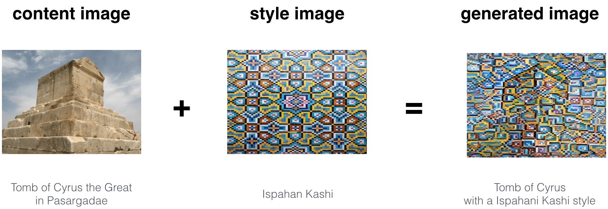

# Neural Style Transfer


Neural Style Transfer is a technique that uses deep learning to compose one image in the style of another image. Have your ever wished you could paint like Picasso or Van Gogh? This is your chance!

## Demo


### A few examples
-------------------
* The beautiful ruins of the ancient city of Persepolis (Iran) with the style of Van Gogh (The Starry Night) 
  
* The tomb of Cyrus the great in Pasargadae with the style of a Ceramic Kashi from Ispahan 
  
* A scientific study of a turbulent fluid with the style of a abstract blue fluid painting
  


## Run Locally

* Clone the project

```bash
  git clone https://github.com/srajanseth84/Neural-Style-Transfer.git
```

* Go to the project directory

```bash
  cd Neural-Style-Transfer
```
* Create venv

```bash
  python3 -m virtualenv venv 
```

* Activate the venv

```bash
  source venv/bin/activate
```

* Install dependencies

```bash
  pip install -r requirements.txt
```

* Start the server

```bash
  streamlit run app.py 
```

    

## Authors

- [@srajanseth84](https://github.com/srajanseth84)

  