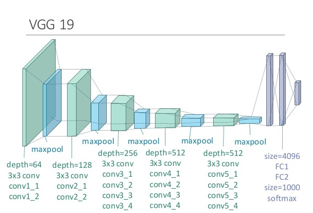

# Neural Style Transfer


Neural Style Transfer is a technique that uses deep learning to compose one image in the style of another image. Have your ever wished you could paint like Picasso or Van Gogh? This is your chance!

## [To View Deployed Demo on Heroku](https://neural-style-transf-streamlit.herokuapp.com/)
## [To View Deployed Demo on Streamlit](https://share.streamlit.io/srajanseth84/all-ml-projects-streamlit/main/app.py)
- Just open above link and select Neural Style Transfer
## Demo
-----


### A Few Examples
-------------------
* The beautiful ruins of the ancient city of Persepolis (Iran) with the style of Van Gogh (The Starry Night) 
  
* The tomb of Cyrus the great in Pasargadae with the style of a Ceramic Kashi from Ispahan 
  
* A scientific study of a turbulent fluid with the style of a abstract blue fluid painting
  

## Run Locally
------

* Clone the project

```bash
  git clone https://github.com/srajanseth84/Neural-Style-Transfer.git
```

* Go to the project directory

```bash
  cd Neural-Style-Transfer
```
* Create venv

```bash
  python3 -m virtualenv venv 
```

* Activate the venv

```bash
  source venv/bin/activate
```

* Install dependencies

```bash
  pip install -r requirements.txt
```

* Start the server

```bash
  streamlit run app.py 
```


## Dependencies
----
* [Tensorflow](https://github.com/tensorflow/tensorflow)
* [Tensorflow-Hub](https://github.com/tensorflow/hub)
* [Streamlit](https://github.com/streamlit/streamlit)
* [Numpy](https://github.com/numpy/numpy)
* [Pillow](https://github.com/python-pillow/Pillow)
* [Arbitrary Image Stylization V1-256](https://tfhub.dev/google/magenta/arbitrary-image-stylization-v1-256/2)

## Transfer Learning
------
Neural Style Transfer (NST) uses a previously trained convolutional network, and builds on top of that. The idea of using a network trained on a different task and applying it to a new task is called transfer learning.


    
Following the original [NST paper](https://arxiv.org/abs/1508.06576), I have used the VGG network. Specifically, VGG-19, a 19-layer version of the VGG network. This model has already been trained on the very large ImageNet database, and thus has learned to recognize a variety of low level features (at the earlier layers) and high level features (at the deeper layers)    

## Author

- [@srajanseth84](https://github.com/srajanseth84)

  